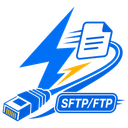
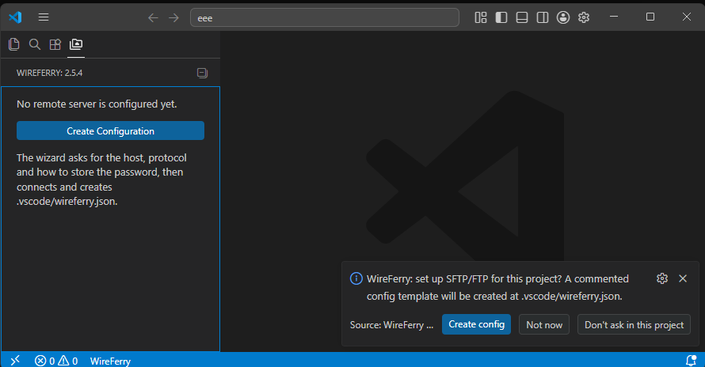
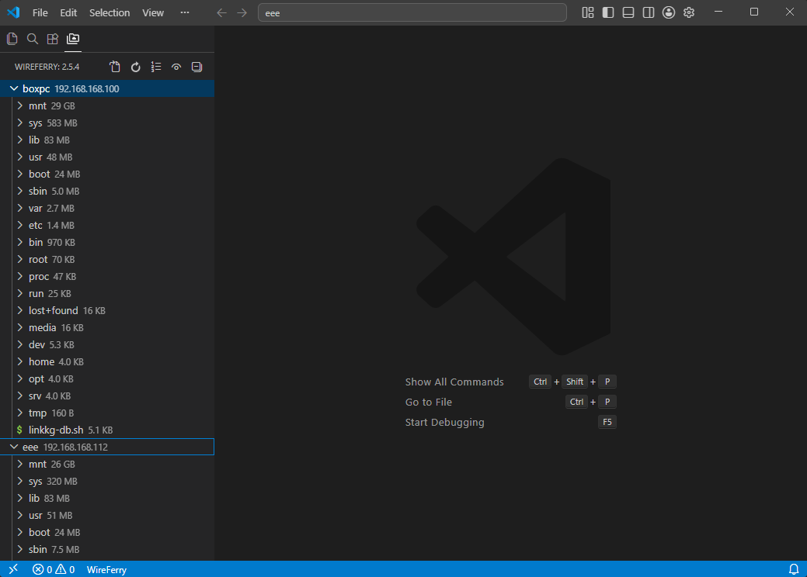

<p align="center">
  
</p>

# WireFerry — синхронизация по SFTP, FTP и FTPS в Visual Studio Code

WireFerry — расширение Visual Studio Code для загрузки, скачивания, сравнения и синхронизации файлов с удалёнными серверами по SFTP, FTP и FTPS. Оно переносит повседневную работу с сайтами, shared-хостингом и VPS в VS Code: есть выгрузка при сохранении и встроенный Remote Explorer.

[English version](README.md) · [Установка](INSTALL.RU.md) · [Конфигурация](docs/configuration.RU.md) · [Команды](docs/commands.RU.md) · [FAQ](FAQ.RU.md) · [История изменений](CHANGELOG.md)

## Скачать и установить

WireFerry опубликован в Visual Studio Code Marketplace. В VS Code откройте **Extensions / Расширения** (`Ctrl+Shift+X`) и найдите `WireFerry`.

**[Открыть WireFerry в Marketplace](https://marketplace.visualstudio.com/items?itemName=EvgeniiShapovalov.wireferry).**

Ручные пакеты `.vsix` также доступны в GitHub Releases для offline-установки или проверки отката:

**[Скачайте `wireferry-<version>.vsix` из последнего GitHub Release](https://github.com/e-u-shapovalov/vscode-sftp/releases/latest).**

> **Если вы обычный пользователь, не нажимайте `Code → Download ZIP`. Скачайте готовый пакет расширения со страницы GitHub Releases.**

Если вы раньше не пользовались GitHub:

1. Откройте страницу [последнего релиза](https://github.com/e-u-shapovalov/vscode-sftp/releases/latest).
2. Найдите и при необходимости раскройте блок **Assets**.
3. Скачайте `wireferry-<version>.vsix`. Не выбирайте архивы **Source code**.
4. В настольном Visual Studio Code откройте **Extensions / Расширения** (`Ctrl+Shift+X`).
5. Откройте меню **...** и выберите **Install from VSIX... / Установить из VSIX...**.
6. Укажите скачанный `.vsix` и перезагрузите VS Code, если редактор попросит.

`.vsix` не нужно распаковывать: это пакет расширения, а не обычный архив. У WireFerry нет отдельного установщика или самостоятельного приложения. Установка через терминал и решение типичных проблем описаны в [руководстве по установке](INSTALL.RU.md).

## Для чего нужен WireFerry

WireFerry сопоставляет локальную папку рабочего пространства VS Code с каталогом на сервере. Можно передать один файл, папку или весь настроенный проект, не разыскивая каждый раз те же пути в отдельном FTP-клиенте.

Типичные сценарии:

- публикация небольших изменений сайта на shared-хостинге;
- редактирование файлов на VPS по SFTP;
- работа с профилями development, staging и production в одном проекте;
- скачивание существующего удалённого проекта в локальную рабочую папку;
- сравнение локального файла с серверной копией перед заменой;
- зеркалирование файлов в другую локальную папку через протокол `local`.

WireFerry — инструмент прямой передачи файлов. Он не заменяет CI/CD, систему управления релизами или систему контроля версий.

## Быстрый старт

1. Откройте в VS Code локальную **папку** проекта.
2. Откройте палитру команд через `Ctrl+Shift+P`.
3. Выполните **WireFerry: Config**.
4. Пройдите мастер настройки. Он запросит протокол, хост, порт, имя пользователя, удалённый путь и способ авторизации, а затем проверит подключение.
5. После успешной проверки мастер создаст `.vscode/wireferry.json`, а сервер появится в **Remote Explorer**.
6. Выгружайте, скачивайте, сравнивайте и синхронизируйте файлы через команды `WireFerry:`, контекстные меню или Remote Explorer.

Мастер поддерживает подключения SFTP и FTP. Старые файлы `.vscode/sftp.json` продолжают распознаваться как legacy-формат. Расширенные настройки FTPS, профилей, jump hosts и локального зеркала задаются в JSONC.



## Основные возможности

- Выгрузка и скачивание файла, папки, активного файла, активной папки или настроенного проекта.
- Синхронизация локально → сервер, сервер → локально и в обе стороны.
- Выгрузка файлов при сохранении в VS Code.
- Наблюдение за изменениями внешних программ с необязательной автовыгрузкой.
- Сравнение локального файла с удалённой версией.
- Просмотр файлов сервера во встроенном Remote Explorer.
- Создание, переименование, перемещение и удаление удалённых файлов и папок.
- Просмотр размеров и прав, подсчёт размера папки, сравнение размера и MD5 локальной и удалённой сторон.
- Несколько профилей и выгрузка одних файлов во все настроенные профили.
- SFTP/SSH, FTP, FTPS и зеркалирование в другую локальную папку.
- SSH jump hosts и открытие SSH-терминала для SFTP-конфигураций.
- Авторизация по SSH-ключу, через защищённое хранилище VS Code или с запросом пароля.
- Проходить keyboard-interactive проверки на серверах с 2FA (`interactiveAuth`).
- Создание и развёртывание SSH-ключа из контекстного меню сервера.
- Восстановление после ошибки прав SFTP через промежуточную копию; на совместимом SSH-сервере — применение через `su`.
- Менять владельца, группу и права на сервере, видеть владельца и группу в подсказках и сразу отличать файлы без права записи по пометке в дереве.
- Просматривать и обрабатывать root-овые пути, недоступные вам для чтения: листать папку, открывать файл только для чтения или удалять через `su`, вводя пароль владельца или root (хранится только в памяти; SFTP/SSH).
- Построить ASCII-дерево папки на сервере или локально из контекстного меню, с необязательным ограничением глубины и размерами файлов.
- Перемещать файлы и папки на сервере перетаскиванием прямо в дереве Remote Explorer; при совпадении имён — сравнить оба объекта и выбрать перезапись, переименование или пропуск, а идентичные файлы дедуплицируются автоматически.
- Следить за выгрузкой и скачиванием по байтовому прогресс-бару с кнопкой отмены; большие файлы (более 10 МБ) и бинарные спрашивают перед открытием.
- Читать отчёт об операции после каждой передачи или удаления по правому клику — вкладку `upload.log`, `download.log` или `delete.log` со списком файлов, их размером, датой и правами. Не хотите, чтобы вас отвлекали? Настройка `wireferry.operationLog` отправит отчёт в канал вывода или отключит его вовсе — уведомление об ошибках придёт в любом случае.
- Передавать атомарно по умолчанию: файл сначала пишется во временную копию и переименовывается на место, поэтому прерванная передача не обнуляет оригинал.
- Распознавать символические ссылки в дереве сервера и открывать их реальную цель.
- Применять локальные удаления, переименования и перемещения на сервере после подтверждения.
- Скачивать серверную копию автоматически при открытии сопоставленного локального файла (`downloadOnOpen`).
- Давать каждому профилю свой корень в дереве и свой upload-on-save, а также удалять с сервера каждого профиля и локальную копию за одно действие.
- Открывать любой файл на сервере по абсолютному пути, даже вне настроенного `remotePath`.
- Мигрировать со старого `sftp.*`: доктор при запуске находит legacy-настройки и `sftp.json` и предлагает их преобразовать.
- Обновляться через VS Code Marketplace и подключаться к старым SSH-серверам, поддерживающим только устаревший обмен ключами Diffie-Hellman.
- Копировать Windows-путь в формате Git Bash (`/c/…`).



## Главное в последнем релизе

Последний релиз позволяет создавать файлы и папки в каталогах, которые вам не принадлежат. ПКМ по `/etc` (или любому root-овому пути) → **Создать файл**, и вместо прежнего тупика «Permission denied» WireFerry предложит **«Создать от root»**: запись выполняется через `su` с тем же одним паролем на окно, что и остальные root-действия, применяются ваши `filePerm`/`dirPerm`, а всё, что уже лежит по этому пути, не трогается — существующий файл или симлинк никогда не обнуляется и не перезаписывается «сквозь ссылку». Создание было последней операцией записи без такой возможности: у выгрузки, скачивания, удаления, chmod/chown и листинга она уже была. Новый файл вдобавок **сразу открывается локально** — можно начинать печатать, а не искать его в дереве, — а сохранение назад идёт через уже существующее «применить от root». Если файл с таким именем уже лежит у вас на диске, WireFerry честно скажет об этом и переспросит перед открытием: на сервер при первом сохранении уедет именно это содержимое, а не пустой файл. При создании теперь виден индикатор, так что на медленном канале окно больше не выглядит зависшим.

Предыдущий релиз отдал вам решение, куда девать журнал операций, и заставил расширение делать заметно меньше лишней работы. Новая настройка **`wireferry.operationLog`** отправляет журнал выгрузки/скачивания/удаления в **новую вкладку** (по умолчанию, как и раньше), в **канал вывода WireFerry** (без вкладки, без кражи фокуса, панель тоже сама не всплывает) или **никуда** — при этом операция с ошибками всё равно даёт уведомление с кнопкой **«Показать журнал»**, так что отключение журнала никогда не заглушает сбой. Под капотом: передача больше не спрашивает у сервера размер файла, который уже знает (на FTP это означало полный листинг папки на каждый файл), сохранение файла больше не выбрасывает кэш всего дерева, а вотчер выгружает пачку по несколько файлов сразу. Два из этих мест вскрыли настоящие баги: **«Выгрузить изменённые» могла молча недосчитаться файлов**, потому что каждое сохранение сбрасывало очередь фоновых проверок, а пачка вотчера могла **молча потерять правку**, посчитав файл всё ещё скачивающимся. Отрисовка дерева тоже подешевела — настройки и язык больше не перечитываются на каждую строку — причём порядок сортировки остался ровно прежним.

До него была большая доработка дерева сервера. Новая кнопка на панели **«Выгрузить изменённые»** заливает все изменённые (M) файлы из дерева разом — записываемые идут обычным путём, root-овые ставятся во временную папку и применяются через `su` по одному паролю; **«Перечитать изменённые файлы»** по ПКМ на папке пересканирует её (даже свёрнутую) и обновляет метки M. Статус понятнее: **L** (только локально) теперь **зелёный**, **R** (только на сервере) **синий**, синхронный файл теряет inline-кнопку Download и показывает зачёркнутые Download/Upload в меню, **🔒** помечает файл, который вы не можете прочитать (ПКМ → «Показать от root»), а папка, которую не удаётся прочитать целиком, показывает строку **«Список неполный — Показать всё от root…»**, чтобы один общий файл не выдавал себя за всю папку. Жёлтое **M больше не пропадает после «Обновить»**, папки-предки вплоть до корня подсвечиваются корректно, а при выполнении root-команды (`su`) показывается **индикатор**. **Удаление серверной папки, полностью забэкапленной локально**, больше не требует ввода «yes». Плюс большой пакет исправлений из нескольких раундов ревью (`remotePath` со слэшем в конце, зеркальная синхро-удаление игнорируемого файла на пути-соседе, закалка batch-загрузки от root и числовые id в листингах «от root», чтобы метки доступа вычислялись).

Подробности текущего и предыдущих выпусков находятся в [CHANGELOG.md](CHANGELOG.md).

## Конфигурация

WireFerry читает JSON с комментариями и завершающими запятыми из `.vscode/wireferry.json`. Первый конфиг создаёт мастер, а VS Code показывает описания полей и проверяет их по встроенной схеме.

Минимальная конфигурация SFTP при ручном редактировании:

```json
{
  "name": "Production",
  "host": "example.com",
  "protocol": "sftp",
  "port": 22,
  "username": "deploy",
  "password": "prompt",
  "remotePath": "/var/www/site",
  "uploadOnSave": false,
  "ignore": [".vscode", ".git", "node_modules"]
}
```

`context` задаёт локальную папку, а `remotePath` — соответствующую папку на сервере. Правила исключения не подхватываются из `.gitignore` автоматически: если WireFerry должен читать этот файл, явно задайте `ignoreFile`.

Перед первой выгрузкой проекта или синхронизацией проверьте:

- `context` и `remotePath`;
- `ignore` и `ignoreFile`;
- активный профиль;
- `syncOption`, особенно настройки удаления.

SFTP, FTP/FTPS, `local`, профили, jump hosts, watcher и все поддерживаемые поля описаны в [справочнике конфигурации](docs/configuration.RU.md).

## Основные команды

Откройте палитру через `Ctrl+Shift+P` и введите `WireFerry`.

| Команда | Назначение |
| --- | --- |
| `WireFerry: Config` | Запустить мастер или открыть существующий конфиг |
| `WireFerry: Upload Active File` | Выгрузить открытый в редакторе файл |
| `WireFerry: Upload Changed Files` | Выгрузить изменения рабочего дерева Git; сочетание по умолчанию `Ctrl+Alt+U` |
| `WireFerry: Upload Project` | Выгрузить всё внутри настроенного `context` |
| `WireFerry: Download Project` | Скачать настроенный удалённый проект |
| `WireFerry: Sync Local -> Remote` | Синхронизировать локальную папку на сервер |
| `WireFerry: Sync Remote -> Local` | Синхронизировать серверную папку на компьютер |
| `WireFerry: Sync Both Directions` | Скопировать более новую версию каждого файла в обе стороны |
| `WireFerry: Diff Active File with Remote` | Сравнить открытый локальный файл с удалённой копией |
| `WireFerry: Open SSH in Terminal` | Открыть SSH-сессию для SFTP-конфигурации |
| `WireFerry: Cancel All Transfers` | Остановить текущие выгрузки и скачивания |

Контекстные действия, Remote Explorer и мультипрофильные команды описаны в [справочнике команд](docs/commands.RU.md).

## Авторизация и безопасность

- Для SFTP по возможности используйте SSH-ключ.
- `"password": "secretStorage"` хранит пароль через VS Code SecretStorage, а не в файле проекта.
- `"password": "prompt"` спрашивает пароль при каждом подключении и не сохраняет его.
- Обычная строка в поле `password` хранится в `.vscode/wireferry.json` открытым текстом. Не коммитьте её.
- Мастер добавляет `.vscode`, `.git` и `.DS_Store` в начальный список `ignore`. В ручном конфиге правила исключения нужно указать самостоятельно.
- Синхронизация может перезаписывать или удалять файлы в зависимости от `syncOption`. Проверяйте новую конфигурацию на некритичных данных и делайте резервные копии.
- WireFerry не работает в Restricted Mode. Доверяйте только тем рабочим пространствам, содержимое которых вы проверили.

## Ограничения

- Требуется настольный Visual Studio Code 1.66 или новее.
- WireFerry работает внутри VS Code; отдельного GUI и собственного CLI нет.
- Поддержка браузерных вариантов VS Code в документации проекта не заявлена.
- `remoteTimeOffsetInHours` есть в схеме, но сейчас не применяется в конвейере передачи.
- Для FTP значение concurrency принудительно равно `1`.
- Одновременные `uploadOnSave` и `watcher.autoUpload` для одних файлов могут вызвать повторную выгрузку.
- Права, квоты, политики SSH/FTP и доступные shell-команды определяет сервер.

Известные ошибки и унаследованный технический долг перечислены в [ROADMAP.md](ROADMAP.md).

## Устранение проблем

### Вместо расширения скачан Source code

Удалите ZIP или TAR.GZ, вернитесь к [последнему релизу](https://github.com/e-u-shapovalov/vscode-sftp/releases/latest), раскройте **Assets** и скачайте `wireferry-<version>.vsix`. Архив исходников нельзя установить как готовое расширение.

### Не появились команды WireFerry или дерево сервера

Убедитесь, что расширение установлено и включено, перезагрузите VS Code, откройте папку, а не отдельный файл, и проверьте доверие к workspace. Выполните **WireFerry: Config**, чтобы создать конфиг. Меню передачи недоступны, пока корректная конфигурация не загружена.

### `Config Not Found`

Откройте корень проекта, а не отдельный файл. Проверьте, что `.vscode/wireferry.json` находится в открытом workspace, а текущий файл — внутри настроенного `context`.

### Файлы попадают не в ту папку

Проверьте `context` и `remotePath`: это локальный и удалённый корни, которые WireFerry сопоставляет друг с другом.

### На сервер ушли лишние файлы

Добавьте gitignore-совместимые шаблоны в `ignore` или укажите подходящий файл через `ignoreFile`. Параметр `filesExclude` у Remote Explorer только скрывает элементы в дереве и не исключает их из передачи.

### Старый SSH-сервер закрывает соединение

Серверу может требоваться устаревший алгоритм обмена ключами или ключ хоста. Добавьте через `algorithms` только тот алгоритм, который нужен этому серверу; пример есть в [FAQ](FAQ.RU.md#sftp-соединение-закрывается-или-появляется-unknown-dh-group).

### Нужны диагностические логи

Включите `wireferry.debug`, перезагрузите окно VS Code и откройте **View / Вид → Output / Вывод → WireFerry**. Перед публикацией логов удалите пароли и чувствительные пути.

Другие решения собраны в [FAQ и руководстве по устранению проблем](FAQ.RU.md).

## Разработчикам

Репозиторий содержит расширение на TypeScript, которое собирается Webpack. Исходный entry point — `src/extension.ts`; `npm run compile` создаёт `dist/extension.js`. Точная минимальная версия Node.js/npm в проекте не объявлена, поэтому используйте актуальный поддерживаемый выпуск Node.js.

```bash
git clone https://github.com/e-u-shapovalov/vscode-sftp.git
cd vscode-sftp
npm ci
npm run compile
npm test
npx tsc --noEmit
```

Режим пересборки при изменениях:

```bash
npm run dev
```

Сборка устанавливаемого пакета:

```bash
npx @vscode/vsce package
code --install-extension wireferry-<version>.vsix
```

Команда `code` необязательна: собранный пакет можно установить через **Extensions / Расширения → ... → Install from VSIX...**. Проверки для участников проекта описаны в [CONTRIBUTING.md](CONTRIBUTING.md).

## FAQ

### Что скачивать?

Установите WireFerry из [Visual Studio Code Marketplace](https://marketplace.visualstudio.com/items?itemName=EvgeniiShapovalov.wireferry). Для offline/ручной установки скачайте `wireferry-<version>.vsix` из блока **Assets** на странице [последнего GitHub Release](https://github.com/e-u-shapovalov/vscode-sftp/releases/latest). Архив исходников для обычной установки не нужен.

### Есть ли у WireFerry отдельный FTP-клиент или CLI?

Нет. WireFerry работает внутри настольного Visual Studio Code. `code --install-extension` — команда установки расширения в VS Code, а не CLI WireFerry.

### Можно ли выгружать сайт при каждом сохранении файла?

Да. Задайте `uploadOnSave` для нужной конфигурации или профиля. Сначала проверьте `context`, `remotePath` и правила исключения.

### Можно ли скачать существующий сайт?

Да. Откройте пустую локальную папку, настройте правильный `remotePath` и выполните **WireFerry: Download Project**. Перед экспериментами с синхронизацией сделайте резервную копию важных данных.

### Это оригинальное расширение `vscode-sftp`?

Нет. WireFerry — независимо поддерживаемый fork, который не выдаёт себя за оригинальный проект. Происхождение: Natizyskunk/vscode-sftp ← liximomo/vscode-sftp; этот fork начат с upstream `v1.16.3` и теперь выпускается под другим именем и издателем.

## Поддержка, происхождение и лицензия

- Ошибки и предложения: [GitHub Issues](https://github.com/e-u-shapovalov/vscode-sftp/issues).
- Установка: [Visual Studio Code Marketplace](https://marketplace.visualstudio.com/items?itemName=EvgeniiShapovalov.wireferry), ручные пакеты — [GitHub Releases](https://github.com/e-u-shapovalov/vscode-sftp/releases).
- Пользовательские изменения: [CHANGELOG.md](CHANGELOG.md).

WireFerry поддерживает [Evgenii Shapovalov](https://github.com/e-u-shapovalov). Проект распространяется по [лицензии MIT](LICENSE); обязательные исходные copyright и attribution notices сохранены в `LICENSE`.
