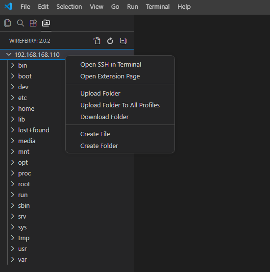

# WireFerry — SFTP/FTP синхронизация и деплой для Visual Studio Code

**WireFerry** — расширение VS Code для загрузки, скачивания, сравнения и синхронизации файлов с удалённым сервером по **SFTP**, **FTP** и **FTPS**. Оно помогает править проект локально и отправлять изменения на хостинг, VPS, staging или production без отдельного FTP-клиента.

[](https://github.com/e-u-shapovalov/vscode-sftp/releases/latest)
[](LICENSE)

Происхождение проекта: WireFerry — форк [Natizyskunk/vscode-sftp](https://github.com/Natizyskunk/vscode-sftp), который сам является форком [liximomo/vscode-sftp](https://github.com/liximomo/vscode-sftp).

## Скачать

**Обычному пользователю нужен готовый файл расширения: [`wireferry-<version>.vsix`](https://github.com/e-u-shapovalov/vscode-sftp/releases/latest).**

1. Скачайте `.vsix` со страницы [GitHub Releases](https://github.com/e-u-shapovalov/vscode-sftp/releases/latest).
2. Откройте VS Code.
3. Перейдите в **Extensions / Расширения** (`Ctrl+Shift+X`).
4. Нажмите **...** в правом верхнем углу панели расширений.
5. Выберите **Install from VSIX... / Установить из VSIX...**.
6. Укажите скачанный файл `wireferry-<version>.vsix` и перезагрузите VS Code, если редактор попросит.

> Если вы просто хотите установить расширение, **не нажимайте `Code -> Download ZIP`** и не скачивайте `Source code`. Эти архивы нужны разработчикам. Для установки скачивайте файл из блока **Assets** на странице релиза: `wireferry-<version>.vsix`.

Полная инструкция для новичков: [INSTALL.md](https://github.com/e-u-shapovalov/vscode-sftp/blob/develop/INSTALL.md).

## Запустить за 2 минуты

1. Откройте в VS Code локальную папку проекта.
2. Нажмите `Ctrl+Shift+P` и выполните команду **WireFerry: Config**.
3. В проекте появится файл `.vscode/wireferry.json`.
4. Заполните данные сервера:

```json
{
  "name": "Production",
  "host": "example.com",
  "protocol": "sftp",
  "port": 22,
  "username": "deploy",
  "remotePath": "/var/www/site",
  "uploadOnSave": false
}
```

5. Сохраните конфиг.
6. Снова нажмите `Ctrl+Shift+P`, введите `WireFerry` и выберите нужную команду: **Upload Project**, **Download Project**, **Sync Local -> Remote**, **Diff Active File with Remote**.

Старые проекты с `.vscode/sftp.json` продолжают работать: WireFerry читает этот файл как совместимый legacy-конфиг.

## Что решает WireFerry

Без WireFerry типичный цикл выглядит так: открыть FTP-клиент, найти нужную папку на сервере, перетащить файл, проверить путь, повторить после каждого изменения. Это медленно и легко ошибиться папкой.

WireFerry переносит этот цикл в VS Code:

- сохранить файл и выгрузить его на сервер;
- отправить один файл, папку или весь проект;
- скачать проект с сервера в локальную папку;
- сравнить локальный файл с удалённой версией;
- синхронизировать локальную и удалённую папку;
- открыть серверное дерево в боковой панели VS Code;
- держать несколько профилей, например `dev`, `stage`, `production`;
- отправлять изменения во все профили, когда один и тот же код нужен на нескольких серверах.

## Кому подходит

- веб-разработчикам, которые выкладывают сайт на shared-хостинг, VPS или выделенный сервер;
- администраторам, которым нужно быстро править конфиги и скрипты через SFTP/SSH;
- фрилансерам с несколькими клиентскими серверами;
- командам, где staging и production находятся на разных хостах;
- пользователям VS Code, которым нужен простой SFTP/FTP-клиент внутри редактора;
- тем, кто ищет замену ручному FileZilla/WinSCP-циклу для частых мелких правок.

WireFerry не заменяет CI/CD и не пытается быть полноценной системой релизов. Это рабочий инструмент для контролируемой передачи файлов между локальной папкой и сервером.

## Скриншоты

### Remote Explorer



Remote Explorer показывает удалённые файлы в боковой панели VS Code. Из него можно открывать, скачивать, выгружать, переименовывать, удалять и переносить файлы между папками сервера.

Для будущих релизов полезно добавить ещё два скриншота в `assets/showcase/`: установку `.vsix` через **Install from VSIX...** и пример `.vscode/wireferry.json`.

## ✨ Что нового · What's New

**Русский — коротко**
- **2.0.7** — конфиг создаётся **по запросу**: расширение спрашивает, нужен ли в проекте SFTP/FTP (с вариантом «не спрашивать в этом проекте»), а не создаёт молча; после удаления конфига спросит снова. Шаблон — на языке `wireferry.alertLanguage`. ПКМ по папке в проводнике → **WireFerry: Config**.
- **2.0.6** — совместимость с легаси `sftp.*`: старые настройки снова работают (читаются как `wireferry.*`). При старте расширение проверяет `settings.json` и конфиг и подсказывает с номерами строк, что заменить (`sftp.*` → `wireferry.*`) или удалить; умеет починить `settings.json` автоматически и предложить переименовать `.vscode/sftp.json` в `wireferry.json`. Конфиг теперь допускает комментарии (JSONC), а для нового проекта создаётся подробный шаблон. Добавлена проверка обновлений на GitHub (с вашего согласия, один HTTPS-запрос, без телеметрии) и команда **«Проверить обновления»**. Появились настройка языка сообщений (`wireferry.alertLanguage`) и окно-отчёт диагностики, которое висит, пока не закроешь.
- **2.0.5** — удаление из дерева сервера теперь спрашивает, *где* удалять: **на сервере**, **на компьютере** или **и там и там** (локальная копия уходит в Корзину ОС, а не стирается). Создание папки с уже существующим именем показывает понятное сообщение вместо «Failure». Ошибки SFTP стали читаемее: код 4 расшифровывается, к сообщению добавляются операция и путь. Обновлены руководства (README/INSTALL/FAQ).
- **2.0.4** — исправлены правила `ignore` на Windows-путях со смешанным регистром (регрессия после 2.0.3 — `node_modules`/`.git` могли выгружаться на сервер); протокол `local` добавлен в схему конфига; уточнения в документации.
- **2.0.3** — исправлена выгрузка при сохранении на сетевых (UNC) путях Windows (`\\сервер\…`): больше нет «Config Not Found». Синхронизация теперь дожидается завершения удаления файлов; правки в документации и схеме настроек.
- **2.0.2** — русская локализация команд и настроек (для русского интерфейса VS Code) + пункт «Открыть страницу расширения» в контекстном меню сервера.
- **2.0.1** — новая иконка на боковой панели (Activity Bar / «Remote Explorer»).
- **2.0.0** — новое имя: **WireFerry**. Новая иконка, команды и настройки переехали на префикс `wireferry.*`, файл конфигурации теперь `.vscode/wireferry.json` (старый `.vscode/sftp.json` ещё читается). Свои горячие клавиши/настройки под `sftp.*` обновите на `wireferry.*`.
- **1.1.2** — технический релиз: усиление безопасности (проверка имён файлов, присланных сервером, и полей SSH-подключения).
- **1.1.1** — переименование и перемещение: «Rename» по ПКМ на сервере, авто-синхрон при переименовании/переносе файла локально, и drag&drop файлов между папками прямо в дереве сервера. Плюс большое обновление зависимостей и движка (минимум VS Code теперь 1.66).
- **1.0.9** — открыть файл на сервере по полному пути одной кнопкой.
- **1.0.6** — созданные файлы сразу видны в дереве без «Обновить» (папки — ещё с 1.0.4).
- **1.0.2** — команда «Copy Path»: копировать серверный путь файла/папки.
- **1.0.0** — работает на Node 22+; безопасное удаление с модальным подтверждением.

**English — in short**
- **2.0.7** — the config is created **on request**: WireFerry asks whether a project needs SFTP/FTP (with a "don't ask in this project" option) instead of creating it silently; delete the config and it asks again. The template follows `wireferry.alertLanguage`. Right-click a folder in the Explorer → **WireFerry: Config**.
- **2.0.6** — legacy `sftp.*` compatibility: old settings work again (read as `wireferry.*`). On startup WireFerry checks your `settings.json` and config and points out, with line numbers, what to rename (`sftp.*` → `wireferry.*`) or remove; it can fix `settings.json` automatically and offer to rename `.vscode/sftp.json` to `wireferry.json`. Configs now allow comments (JSONC), and a fully-commented template is created for new projects. Added an opt-in GitHub update check (one HTTPS request, only after you agree, no telemetry) and a **"Check for Updates"** command. Plus a `wireferry.alertLanguage` setting and a persistent report tab for the config doctor.
- **2.0.5** — deleting from the server tree now asks *where* to delete: **on the server**, **on the computer**, or **on both** (the local copy goes to the OS trash, it is not erased). Creating a folder whose name already exists now shows a clear message instead of "Failure". SFTP errors are more readable: status 4 is decoded and the failing operation and path are appended. Manuals updated (README/INSTALL/FAQ).
- **2.0.4** — fixed `ignore` rules on mixed-case Windows paths (a 2.0.3 regression — `node_modules`/`.git` could be uploaded to the server); the `local` protocol is now in the config schema; documentation clarifications.
- **2.0.3** — fixed upload-on-save on Windows network (UNC) paths (`\\server\…`): no more "Config Not Found". Sync now waits for file deletions to finish; documentation & settings-schema fixes.
- **2.0.2** — Russian localization of commands & settings (for Russian VS Code) + an "Open Extension Page" item in the server context menu.
- **2.0.1** — new side-panel icon (Activity Bar / Remote Explorer).
- **2.0.0** — new name: **WireFerry**. New icon, commands & settings moved to the `wireferry.*` prefix, and config is now `.vscode/wireferry.json` (legacy `.vscode/sftp.json` still read). Update any custom `sftp.*` keybindings/settings to `wireferry.*`.
- **1.1.2** — maintenance release: security hardening (validates server-sent filenames and SSH connection fields).
- **1.1.1** — rename & move: "Rename" on the server via right-click, auto-sync when you rename/move a file locally, and drag&drop files between folders right in the server tree. Plus a large dependency & toolchain update (minimum VS Code is now 1.66).
- **1.0.9** — open a server file by its full path with one button.
- **1.0.6** — newly created files show in the tree instantly, no manual Refresh (folders since 1.0.4).
- **1.0.2** — "Copy Path" command: copy a file/folder's server-side path.
- **1.0.0** — works on Node 22+; safe delete with a modal confirmation.

Полный список изменений: [CHANGELOG.md](https://github.com/e-u-shapovalov/vscode-sftp/blob/develop/CHANGELOG.md).

## Возможности

- **SFTP через SSH**: логин по паролю, приватному ключу, passphrase-диалог, ssh-agent/Pageant, keyboard-interactive authentication.
- **FTP и FTPS**: обычный FTP, TLS-режимы `secure`, passive mode.
- **Local protocol**: синхронизация с другой папкой на той же машине без серверного подключения.
- **Upload / Download**: файл, активный файл, папка, активная папка, весь проект.
- **Upload on save**: выгрузка файла на сервер при сохранении в VS Code.
- **File watcher**: автозагрузка файлов, изменённых вне редактора.
- **Sync**: локально -> сервер, сервер -> локально, обе стороны.
- **Diff**: сравнение локальной версии с удалённой.
- **Remote Explorer**: дерево удалённых файлов в Activity Bar.
- **Операции на сервере**: создать файл/папку, переименовать, удалить, скопировать путь, открыть по полному пути.
- **Несколько профилей**: переключение серверов и команды выгрузки во все профили.
- **Connection hopping**: подключение к целевому SFTP-серверу через промежуточные SSH-хосты.
- **Ignore rules**: исключение `.git`, `node_modules`, временных файлов и пользовательских шаблонов.
- **Open SSH in Terminal**: открыть SSH-подключение к настроенному серверу из VS Code.

## Где находятся GitHub Releases

GitHub Releases — это страница готовых выпусков проекта:

<https://github.com/e-u-shapovalov/vscode-sftp/releases/latest>

На странице релиза найдите блок **Assets**. В нём должен быть файл вида:

```text
wireferry-<version>.vsix
```

Именно этот файл устанавливается в VS Code. Архивы **Source code (zip)** и **Source code (tar.gz)** не являются готовым расширением.

## Установка через командную строку

Если команда `code` доступна в терминале:

```bash
code --install-extension wireferry-<version>.vsix
```

Запускайте команду из папки, куда скачан `.vsix`, или укажите полный путь к файлу.

## Примеры конфигурации

### SFTP с приватным ключом

```json
{
  "name": "VPS",
  "host": "203.0.113.10",
  "protocol": "sftp",
  "port": 22,
  "username": "deploy",
  "privateKeyPath": "~/.ssh/id_rsa",
  "passphrase": true,
  "remotePath": "/var/www/app",
  "uploadOnSave": true,
  "ignore": [".git", "node_modules", "*.log"]
}
```

### FTPS

```json
{
  "name": "Hosting",
  "host": "ftp.example.com",
  "protocol": "ftp",
  "port": 21,
  "secure": true,
  "passive": true,
  "username": "user",
  "remotePath": "/public_html"
}
```

### Несколько профилей

```json
{
  "defaultProfile": "stage",
  "profiles": {
    "stage": {
      "name": "Stage",
      "host": "stage.example.com",
      "protocol": "sftp",
      "username": "deploy",
      "remotePath": "/var/www/stage"
    },
    "production": {
      "name": "Production",
      "host": "example.com",
      "protocol": "sftp",
      "username": "deploy",
      "remotePath": "/var/www/site"
    }
  }
}
```

### Синхронизация с локальной папкой

```json
{
  "name": "Local mirror",
  "protocol": "local",
  "host": "localhost",
  "username": "local",
  "remotePath": "D:/mirror/site"
}
```

Для `local` поля `host` и `username` пока нужны валидатору, но не используются для подключения.

## Основные команды

Команды доступны через `Ctrl+Shift+P`, контекстное меню проводника VS Code и Remote Explorer:

| Команда | Что делает |
| --- | --- |
| `WireFerry: Config` | создаёт или открывает `.vscode/wireferry.json` |
| `WireFerry: Set Profile` | выбирает активный профиль |
| `WireFerry: Upload Active File` | выгружает текущий файл |
| `WireFerry: Upload Changed Files` | выгружает файлы, изменённые в Git; горячая клавиша `Ctrl+Alt+U` |
| `WireFerry: Upload Project` | выгружает весь проект |
| `WireFerry: Download Project` | скачивает удалённую папку проекта |
| `WireFerry: Sync Local -> Remote` | синхронизирует локальную папку на сервер |
| `WireFerry: Sync Remote -> Local` | синхронизирует серверную папку локально |
| `WireFerry: Sync Both Directions` | оставляет новые версии файлов на обеих сторонах |
| `WireFerry: Diff Active File with Remote` | сравнивает текущий файл с сервером |
| `WireFerry: Open SSH in Terminal` | открывает SSH к серверу в терминале VS Code |
| `WireFerry: Cancel All Transfers` | останавливает текущие передачи |

Подробный список: [docs/commands.md](https://github.com/e-u-shapovalov/vscode-sftp/blob/develop/docs/commands.md).

## Важные ограничения

- `password` в `.vscode/wireferry.json` хранится открытым текстом. Для SFTP лучше использовать приватный ключ или не указывать пароль, чтобы WireFerry спросил его при подключении.
- `remoteTimeOffsetInHours` сейчас описан в схеме, но не применяется в transfer pipeline. Не рассчитывайте на него для точной синхронизации по времени.
- Для `ftp` параметр `concurrency` принудительно равен `1`, даже если в конфиге указано другое значение.
- Не включайте одновременно `uploadOnSave: true` и `watcher.autoUpload: true` на один и тот же набор файлов: это может привести к двойной выгрузке одного сохранения.
- Удаление и синхронизация с `syncOption.delete` требуют осторожности: проверяйте `remotePath`, `context` и `ignore`, чтобы не затронуть лишние файлы.

## FAQ

### Что скачивать: `.vsix`, `Source code` или `Code -> Download ZIP`?

Для установки скачивайте только `.vsix` из **Releases -> Assets**. `Source code` и `Code -> Download ZIP` — это исходники для разработчиков.

### Где находится установленное расширение?

В VS Code откройте **Extensions / Расширения** и найдите **WireFerry**. Если расширение установлено из `.vsix`, оно отображается так же, как обычные расширения.

### Как понять, что WireFerry видит мой проект?

В проекте должен быть `.vscode/wireferry.json` или legacy-файл `.vscode/sftp.json`. После этого команды WireFerry появляются в палитре команд и контекстных меню.

### Можно ли скачать существующий сайт с сервера?

Да. Откройте пустую локальную папку, создайте конфиг с правильным `remotePath`, затем выполните **WireFerry: Download Project**.

### Можно ли выгружать только папку `dist` или `build`?

Да. Укажите `context`, например `"context": "./dist"`. Тогда содержимое этой папки будет сопоставлено с `remotePath`.

### Что лучше: SFTP, FTP или FTPS?

Если сервер поддерживает SFTP, обычно выбирайте `protocol: "sftp"`: он работает поверх SSH. FTP используйте только когда сервер не даёт SFTP. Для FTP с TLS включайте `secure`.

### Где английская версия README?

Английская версия: [README.en.md](https://github.com/e-u-shapovalov/vscode-sftp/blob/develop/README.en.md).

Больше вопросов и решений: [FAQ.md](https://github.com/e-u-shapovalov/vscode-sftp/blob/develop/FAQ.md).

## Устранение проблем

### `Config Not Found`

Проверьте, что вы открыли именно папку проекта, а конфиг лежит внутри неё: `.vscode/wireferry.json`. Если файл находится выше или ниже открытой папки, расширение не сможет сопоставить локальный путь с сервером.

### Файлы выгружаются не туда

Проверьте пару `context` + `remotePath`. `context` отвечает за локальную подпапку, `remotePath` — за удалённую папку на сервере.

### На сервер ушёл `node_modules` или `.git`

Добавьте исключения:

```json
{
  "ignore": [".git", "node_modules", ".DS_Store", "*.log"]
}
```

В версии 2.0.4 исправлена регрессия с `ignore` на Windows-путях со смешанным регистром.

### Нужны подробные логи

В настройках VS Code включите `wireferry.debug`, перезагрузите окно и откройте **View -> Output -> WireFerry**.

### SFTP пишет `Connection closed`

На старых серверах может потребоваться явный список SSH-алгоритмов. См. готовый пример в [FAQ.md](https://github.com/e-u-shapovalov/vscode-sftp/blob/develop/FAQ.md#error-connection-closed).

## Разработчикам

Требуется Node.js и npm.

```bash
git clone https://github.com/e-u-shapovalov/vscode-sftp.git
cd vscode-sftp
npm install
npm run compile
```

Полезные команды:

```bash
npm run dev
npm test
npx tsc --noEmit
npx @vscode/vsce package
```

После упаковки появится файл вида `wireferry-<version>.vsix`. Его можно установить локально:

```bash
code --install-extension wireferry-<version>.vsix
```

Правила участия в разработке: [CONTRIBUTING.md](https://github.com/e-u-shapovalov/vscode-sftp/blob/develop/CONTRIBUTING.md). Планы и известные технические долги: [ROADMAP.md](https://github.com/e-u-shapovalov/vscode-sftp/blob/develop/ROADMAP.md).

## SEO и поисковые фразы

WireFerry закрывает реальные поисковые сценарии: **SFTP extension for VS Code**, **FTP deploy from Visual Studio Code**, **VS Code SFTP sync**, **upload on save to server**, **remote file explorer for VS Code**, **синхронизация файлов по SFTP в VS Code**, **FTP-клиент для VS Code**, **выгрузка сайта на хостинг из VS Code**, **сравнить локальный файл с файлом на сервере**, **деплой проекта через SFTP/FTPS**.

Эти фразы описывают фактические функции расширения и помогают найти проект пользователям, которым нужен не архив исходников, а готовый инструмент для передачи файлов.

## English

WireFerry is a VS Code extension for SFTP, FTP and FTPS file sync, upload, download and remote-server browsing. Download the ready-to-install `.vsix` from [GitHub Releases](https://github.com/e-u-shapovalov/vscode-sftp/releases/latest), then install it via **Extensions -> ... -> Install from VSIX...**.

Full English README: [README.en.md](https://github.com/e-u-shapovalov/vscode-sftp/blob/develop/README.en.md).

## Обратная связь

- Ошибки и предложения: <https://github.com/e-u-shapovalov/vscode-sftp/issues>
- Релизы: <https://github.com/e-u-shapovalov/vscode-sftp/releases>
- Репозиторий: <https://github.com/e-u-shapovalov/vscode-sftp>

## История и лицензия

WireFerry — независимо поддерживаемый форк [Natizyskunk/vscode-sftp](https://github.com/Natizyskunk/vscode-sftp), который сам является форком [liximomo/vscode-sftp](https://github.com/liximomo/vscode-sftp). Основа форка — upstream `v1.16.3`; дальше проект развивается отдельно.

Лицензия: [MIT](LICENSE). Copyright for the fork © 2026 Evgenii Shapovalov; original copyright notices are preserved in the license as required by MIT.
