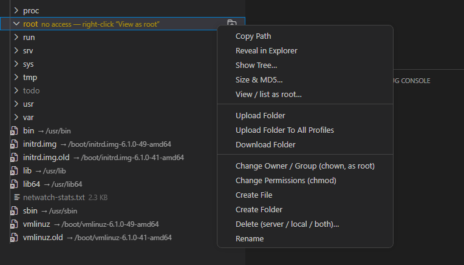
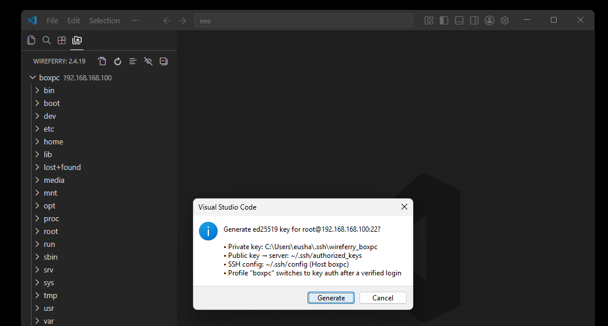

# WireFerry Command Reference

[Русская версия](commands.RU.md) · [Main README](../README.md) · [Configuration](configuration.md) · [FAQ](../FAQ.md)

Open the Command Palette with `Ctrl+Shift+P` and type `WireFerry`. Many transfer commands also appear in the local Explorer, editor, Source Control or Remote Explorer context menu.

Commands that need a server are available after a valid `.vscode/wireferry.json` or legacy `.vscode/sftp.json` has been loaded.

## Setup and connection

| Command | Purpose |
| --- | --- |
| `WireFerry: Config` | Run the setup wizard when no config exists, or open the current config |
| `WireFerry: Set Profile` | Select the active profile for commands without an explicit profile context |
| `WireFerry: Open SSH in Terminal` | Open an SSH terminal for the current SFTP connection |
| `WireFerry: Check for Updates` | Ask VS Code to check Marketplace extension updates and open the WireFerry extension page |
| `WireFerry: Open Extension Page` | Open the extension page in VS Code |
| `WireFerry: Cancel All Transfers` | Stop current upload and download tasks |

`Open SSH in Terminal` applies only to SFTP/SSH configurations.

## Upload

| Command | Purpose |
| --- | --- |
| `Upload File` | Upload the selected local or mapped file |
| `Upload Active File` | Upload the file open in the editor |
| `Upload Folder` | Upload the selected folder |
| `Upload Active Folder` | Upload the folder containing the active file |
| `Upload Project` | Upload everything under the configured `context` |
| `Force Upload` | Upload while bypassing ignore rules; exposed as an alternate context-menu action |
| `Upload Changed Files` | Apply Git working-tree/index additions, modifications and renames to the server; asks before server deletions |

The default shortcut for **Upload Changed Files** is `Ctrl+Alt+U`.

When `profiles` are configured, file, active-file, folder, active-folder, project and force-upload commands also have **To All Profiles** variants.

## Download

| Command | Purpose |
| --- | --- |
| `Download File` | Download the selected remote version and replace the mapped local file |
| `Download Active File` | Download the remote version of the active local file |
| `Download Folder` | Download the selected folder |
| `Download Active Folder` | Download the folder containing the active file |
| `Download Project` | Download the configured remote project |
| `Force Download` | Download while bypassing ignore rules; exposed as an alternate context-menu action |

Transfers can overwrite existing files. Verify `context`, `remotePath`, the selected profile and ignore rules first.

## Synchronization and comparison

| Command | Purpose |
| --- | --- |
| `Sync Local -> Remote` | Use the local tree as source and the server as destination |
| `Sync Remote -> Local` | Use the server as source and the local tree as destination |
| `Sync Both Directions` | Compare modification times and place the newer version on both sides |
| `Diff with Remote` | Compare a selected local file with its remote copy |
| `Diff Active File with Remote` | Compare the active editor file with its remote copy |
| `List` | List a remote folder and choose a file |
| `List Active Folder` | List the remote folder mapped to the active file's folder |
| `List All` | List remote files reachable below `remotePath` |

`syncOption` controls creation, update and deletion behavior. Review it before synchronizing important data. For **Sync Both Directions**, only `skipCreate` and `ignoreExisting` apply.

## Remote Explorer

| Command | Purpose |
| --- | --- |
| `Edit in Local` | Download a remote file and open the mapped local copy for editing |
| `View Content` | Open a remote file read-only without saving it into the workspace |
| `Open Remote File by Path` | Enter an absolute remote path and open the file |
| `Open Symlink Target` | Resolve a remote symlink and offer to open its target |
| `Reveal in Explorer` | Reveal a remote item's local counterpart |
| `Reveal in Remote Explorer` | Reveal a local file in the server tree |
| `Copy Path` | Copy the remote path |
| `Refresh` | Reload the Remote Explorer tree |
| `Refresh Active Remote File` | Reload the remote entry for the active file |
| `Show Sizes` / `Hide Sizes` | Toggle sizes in the tree |
| `Sort by Size (largest first)` / `Sort by Name` | Change the tree sort mode |
| `View / list as root…` | List a folder you cannot read, or open an unreadable file read-only, through `su` (SFTP/SSH only) — see [Root access](#root-access-view-list-and-delete-as-root) |
| `Size & MD5…` | Report server/local size and, when available, MD5 for a file or folder |
| `Show Tree…` | Render an ASCII tree of the selected folder into a text tab, with optional file sizes and a depth limit |

### Status markers in the tree

The Remote Explorer shows **one merged entry per file**, combining your local copy and the server copy. Local files appear immediately; the server side fills in a moment later (a status-bar item reads *WireFerry: loading the server listing…* while it loads). A badge marks how the two sides compare:

| Badge | Meaning |
| --- | --- |
| `L` | **Local only** — the file is on your disk but not on the server yet |
| `M` | **Modified** — the local and server copies differ by type, size or confirmed content; parent folders inherit `M` recursively |
| `!` | **Conflict** — a file on one side, a folder on the other |
| `?` | **Unknown** — the server listing could not be read (a transient error, or a permission error over FTP) |
| yellow, no badge | **No access** — a folder you have no permission to list; right-click **View / list as root** |
| `RO` | **Read-only** — you have no write permission for this file |

A file that is in sync, or a server-only file with no badge, needs no marker.

For equal-size regular files, modification time is only a cheap first check. When the times differ,
WireFerry verifies the content with MD5 in the background before showing `M`. Matching content is not
marked modified; its local modification time is aligned to the server time so later listings do not hash
the same file again. If server-side MD5 is unavailable, the modification time remains the fallback.

A single click **opens your local copy directly** when one exists — instantly, without downloading or overwriting anything. For a server-only file the click downloads and opens it, or shows a read-only preview, depending on `wireferry.downloadWhenOpenInRemoteExplorer` (below); a symlink offers to open its target.

With `wireferry.downloadWhenOpenInRemoteExplorer: true`, clicking a server-only file downloads it with progress and then opens it. When the setting is `false`, WireFerry opens a read-only preview instead. Turn on **Show Sizes** to see sizes in the tree; a modified file shows both sides as `server ↔ local`.

Folder size uses a server-side `du` command when available over SFTP and otherwise falls back to walking the remote tree. The **Size & MD5** file report includes both modification timestamps. Server-side MD5 requires suitable shell commands and is unavailable on FTP.

`Show Tree…` first asks how to draw the tree (folders only, with files, or with files and sizes) and a maximum depth (empty or `0` means no limit). The tree opens in a text tab and stops at 20000 entries for very large folders. It is available on folders in both the Remote Explorer and the local Explorer.

You can also **drag and drop** items inside the Remote Explorer to move or rename them on the server; a matching local copy is updated after a confirmation. Moves stay within a single connection — dragging across different profiles is not performed.

## Remote file management

| Command | Purpose |
| --- | --- |
| `Create File` / `Create Folder` | Create an item below the selected remote directory |
| `Rename` | Rename or move a selected remote item |
| `Delete (server / local / both)…` | Choose whether to delete the server copy, local copy or both |
| `Change Permissions (chmod)` | Change remote Unix mode; folders can be handled recursively |
| `Change Owner / Group (chown, as root)` | Run `chown` through `su` on a compatible SSH server |

New files and folders you create in the tree (New File / New Folder) default to `644` / `755` when `filePerm` / `dirPerm` are not set, or take those values when they are (see the [configuration reference](configuration.md#common-fields)). A file you **upload** keeps its local file's mode unless `filePerm` is set.

### Deleting safely

The delete dialog offers **On server**, **On computer**, **On both**, and — when the config defines profiles — **All servers + computer**. A deleted local copy is moved to the operating-system trash, not erased; if the trash is unavailable (for example on some network or substituted drives) WireFerry falls back to permanent deletion and warns you.

When a server-side delete would leave no safe copy behind, WireFerry asks you to type **`yes`** to confirm. That gate is skipped only when every selected item still has an identical local backup, verified by matching **size and MD5**; an **On both** or **All servers + computer** delete always asks. Servers with no server-side MD5 tool (including FTP) can't be verified, so the confirmation always appears there.

### Root access: view, list and delete as root

Some paths on a Unix server are owned by `root` or another user and are not readable or deletable by your login. WireFerry can act on them through `su`, and only over an **SFTP/SSH** connection — FTP has no shell, so these actions are refused there. Right-click any file or folder in the Remote Explorer to reach them; a folder you cannot list is also flagged **yellow** with a *no access — right-click View as root* hint.

| Command | Purpose |
| --- | --- |
| `View / list as root…` | List a folder you cannot read, or open an unreadable file read-only |
| `Download as root` | Offered automatically when reading a file is refused; fetches it via `su` (up to 10 MB) into your local copy so it opens for editing |
| `Upload as root` | Offered automatically when a folder upload is refused for lack of write permission; stages the folder to a temp path, then moves it into place via `su` |
| `Delete as root` | Offered automatically when a normal delete is refused for lack of permission; runs `rm -rf` as root after a confirmation |

- **View / list as root** first asks whether to act as the file's owner (offered when that is safe) or as `root`, then asks for that account's password. A directory is listed in place of the yellow row; a file opens as a read-only, throwaway copy — text is assumed, so a binary may look garbled — and is discarded when you close it.
- **Download as root** appears after a permission-denied download or *Edit in Local*. Root copies the file to a temporary path and WireFerry pulls it byte-for-byte into your workspace copy (up to **10 MB** — a larger file is refused, not truncated), then the temp is removed. Saving your edits back uses the same apply-as-root flow, so the 10 MB limit protects the server file from being overwritten with a partial copy.
- **Upload as root** appears after a folder upload is refused for lack of write permission (uploading a folder into, say, `/root`). WireFerry stages the folder to a temporary path over SFTP, then as `root` copies it into place — owned by root, merging into an existing folder — and removes the staging copy.
- **Delete as root** appears only after a permission-denied delete. It lists the exact paths, always asks for confirmation even if the password is already cached, and refuses to run on `/`. For an **On both** delete the local copy is still moved to the trash.
- The privileged `chmod` retry and `Change Owner / Group (chown, as root)` use the same mechanism. The elevated password is held **in memory only**, tied to the connection's real host, port and account; it is never written to disk, to the config or to the log, and it is cleared when the VS Code window reloads.

## Credentials

| Command | Purpose |
| --- | --- |
| `Generate SSH Key…` | Create an SSH key, deploy the public key and switch after a verified key login |
| `Save Password to Keychain…` | Store a password through VS Code SecretStorage and update the config |
| `Delete Saved Password…` | Remove selected passwords or passphrases from SecretStorage |

SSH key generation is SFTP-only. Password storage is available for main configurations and profiles; jump-host credentials are not stored in SecretStorage.

## Operation reports

After a right-click upload, download or delete, WireFerry opens an `upload.log`, `download.log` or `delete.log` tab that lists each file with its size, modification date and permissions, plus an "N ok, M failed" tally. For deletes it also shows where the local and server copies differ, and a multi-profile run tags each row with its server.

## Local Explorer integration

The local Explorer context menu provides upload, download, sync, diff, delete, size/MD5 and Show Tree actions for mapped items.

`Copy Path (Git Bash)` converts selected Windows paths such as `C:\project\file` to Git Bash form such as `/c/project/file`.

Local rename and move events can be applied to the server after confirmation. Local deletions made through VS Code can likewise be deleted on the server after confirmation; external filesystem changes do not trigger those two confirmation handlers.
