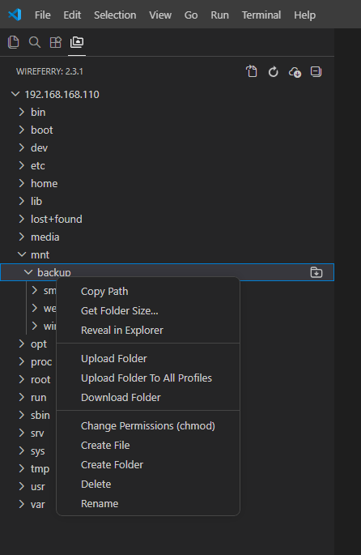

## Common commands

### WireFerry: Config
Create a new configuration file for a project.

### WireFerry: Set Profile
Set the current profile.
           
#### KeyBindings Args
func(profileName: string)

### WireFerry: Upload Active File
Upload the current file.

### WireFerry: Upload Changed Files
Upload all files changed or created since the last commit to your Git.
Can be called by default keyboard shortcut `Ctrl+Alt+U`.

### WireFerry: Upload Active Folder
Upload the entire folder the current file is located in.

### WireFerry: Download Active File
Download the remote version of the current file and overwrite the local copy.

### WireFerry: Download Active Folder
Download the entire folder the current file is located in.

### WireFerry: Sync Local -> Remote
1. Any files that exist on both local and remote that have a different timestamp between local and remote are copied over.
2. Any files that only exist on the local are copied over.

You can change the default behavior with `syncOption`.
See [configuration](./configuration.md).

### WireFerry: Sync Remote -> Local
Same as `Sync Local -> Remote`, but in the opposite direction.

### WireFerry: Sync Both Directions
Compare file modification times, and will always perform the action that causes the newest file to be present in both locations.

*Only `skipCreate` and `ignoreExisting` are valid for this command.*

### WireFerry: List Active Folder
List the folder the current file is located in.

### wireferry.upload
Upload file or folders.

#### KeyBindings Args
func(fspaths: string[])

### wireferry.download
Download file or folders.

#### KeyBindings Args
func(fspaths: string[])

### WireFerry: Cancel All Transfers
Stop the current transfers (upload and download).

### WireFerry: Open SSH in Terminal
Open a terminal in VSCode and auto login to a specific server.

### WireFerry: Open Extension Page
Open the WireFerry extension page inside VS Code.

### WireFerry: Generate SSH Key
Right-click a server in the Remote Explorer to create an SSH key (ed25519/rsa-4096), deploy the public half to the server's `authorized_keys`, register it in `~/.ssh/config`, and switch the profile to key auth after a verified login. Can provision every server in the config at once. SFTP, local extension host only (2.5.0).

### WireFerry: Save Password to Keychain
Right-click a server to store its password in the OS keychain and set `"password": "secretStorage"` in the config — no plaintext password in JSON. If the server uses a key, it offers to drop it for a clean switch to password auth (2.5.0).

### WireFerry: Delete Saved Password
List passwords/passphrases saved in the OS keychain and remove the selected ones (2.5.0).

### WireFerry: Upload File / Upload Folder
Upload the selected file or folder (used from the explorer context menu).

### WireFerry: Upload Project
Upload the whole project (everything under the configuration `context`).

### WireFerry: Download File / Download Folder
Download the selected file or folder, overwriting the local copy.

### WireFerry: Download Project
Download the whole project from the remote.

### WireFerry: Diff with Remote
Compare the selected file with its remote version.

#### KeyBindings Args
func(fspaths: string[])

### WireFerry: Diff Active File with Remote
Compare the current editor file with its remote version.

### WireFerry: List
List a remote folder and pick a file to open.

### WireFerry: List All
List all remote files reachable from the configuration `remotePath`.

### Get Folder Size…

Right-click a folder in the Remote Explorer to total its size. Opens a `folder-size.txt` report tab
with the server path, permissions and size, plus — if the folder is downloaded locally — the local
path, size and the difference. On SFTP the size is read with a single server-side `du -sb` (byte
exact); FTP / servers without `du` fall back to a recursive walk with a live counter and Cancel. The
local size is summed with Node's `fs` (Windows/Linux/macOS). Sizes show as exact grouped bytes and a
human-readable form, e.g. `12 930 967 152 bytes (12 GB)`.

### Open on click (Remote Explorer)
By default (`wireferry.downloadWhenOpenInRemoteExplorer: true`) a single click on a server file
downloads it with a byte progress bar and then opens it: text/source opens straight away, while a
binary, an unrecognized type, or a file over 10 MB asks first (so VS Code doesn't choke on a blob).
Set the option to `false` to get a read-only preview without downloading instead.

## Alt commands
An alternative command can be found when pressing `Alt` while opening a menu.

### Force Download
Download file but disregard ignore rules.

### Force Upload
Upload file but disregard ignore rules.

## Remote Explorer
These commands appear in the **Remote Explorer** view (right-click a server, folder or file).

### Edit in Local
Download the remote file and open the local copy for editing.

### View Content
Open the remote file read-only, without downloading it into the workspace.

### Reveal in Explorer
Reveal the local counterpart of a remote item in the local Explorer.

### Reveal in Remote Explorer
Reveal the active file in the Remote Explorer tree.

### Refresh / Refresh Active Remote File
Reload the tree (or just the entry for the active file).

### Open Remote File by Path
Prompt for an absolute remote path and open that file.

### Copy Path
Copy the remote path of the selected item to the clipboard.

### Create File / Create Folder
Create a new file or folder on the remote under the selected node.

### Rename
Rename the selected remote file or folder.

### Delete
Delete the selected remote file or folder.

## Upload to All Profiles
When the config defines multiple `profiles`, each upload command has a **To All Profiles** variant
(`Upload File`, `Upload Active File`, `Upload Folder`, `Upload Active Folder`, `Upload Project`, `Force Upload`)
that runs the same upload against every profile in turn.
