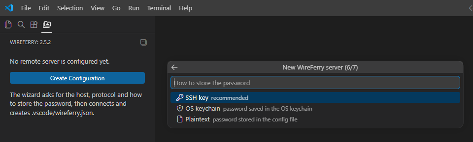

# WireFerry Configuration Reference

[Русская версия](configuration.RU.md) · [Main README](../README.md) · [Commands](commands.md) · [FAQ](../FAQ.md)

WireFerry stores project configuration in `.vscode/wireferry.json`. Legacy `.vscode/sftp.json` files are still read, but new projects should use `wireferry.json`.

The format is JSONC: `//` and `/* ... */` comments plus trailing commas are accepted. VS Code validates known fields with the schemas in `schema/`.

## Create or open a configuration

Open a project folder, press `Ctrl+Shift+P`, and run **WireFerry: Config**.

- If no configuration exists, the setup wizard collects SFTP or FTP connection details, verifies the login, and writes `.vscode/wireferry.json`.
- If a current or legacy configuration exists, the command opens it.
- FTPS, `local`, profiles, jump hosts and advanced transfer options are edited in the file after initial setup.

## Basic examples

### SFTP

```json
{
  "name": "Production",
  "host": "example.com",
  "protocol": "sftp",
  "port": 22,
  "username": "deploy",
  "password": "prompt",
  "remotePath": "/var/www/site",
  "context": "./",
  "uploadOnSave": false,
  "ignore": [".vscode", ".git", "node_modules"]
}
```

### FTP or FTPS

```json
{
  "name": "Hosting",
  "host": "ftp.example.com",
  "protocol": "ftp",
  "port": 21,
  "username": "account",
  "password": "prompt",
  "remotePath": "/public_html",
  "secure": true
}
```

For plain FTP, omit `secure` or set it to `false`. For FTPS modes, see [`secure`](#ftp-and-ftps-fields).

### Local mirror

```json
{
  "name": "Local mirror",
  "protocol": "local",
  "context": "./build",
  "remotePath": "/absolute/path/to/preview"
}
```

`local` uses another directory on the same machine. It does not require `host`, `username` or server credentials. Use an absolute `remotePath` so the destination does not depend on the extension host's working directory.

## Path mapping

`context` is the local root, relative to the opened workspace unless an absolute path is used. `remotePath` is the corresponding root on the server, or the destination directory for `local`.

With `"context": "./build"` and `"remotePath": "/var/www/site"`, the local file `build/css/app.css` maps to `/var/www/site/css/app.css`.

Verify both paths before uploading or synchronizing a project.

## Common fields

| Field | Type | Runtime default | Purpose |
| --- | --- | --- | --- |
| `name` | string | — | Label shown in the status bar and Remote Explorer |
| `protocol` | `sftp`, `ftp`, `local` | `sftp` | Connection or mirror type |
| `context` | string | workspace root | Local root mapped to `remotePath` |
| `remotePath` | string | `./` | Remote root, or destination path for `local` |
| `host` | string | — | Server hostname or IP; required for SFTP/FTP |
| `port` | integer | protocol/client default | Server port |
| `username` | string | — | Login name; required for SFTP/FTP |
| `connectTimeout` | integer | `10000` | Connection timeout in milliseconds |
| `uploadOnSave` | boolean | `false` | Upload files saved in VS Code |
| `downloadOnOpen` | boolean or `"confirm"` | `false` | Replace a local file with the remote copy when opened |
| `concurrency` | integer, 1–512 | `4` | Parallel transfer limit; FTP is always forced to `1` |
| `useTempFile` | boolean | `true` | Stage a transfer beside the destination and rename it into place |
| `openSsh` | boolean | `false` | Use OpenSSH rename behavior for the staged-file replacement |
| `filePerm` | number | — | Octal mode applied to uploaded and newly-created files, for example `644` |
| `dirPerm` | number | — | Octal mode applied to uploaded and newly-created directories, for example `755` |
| `maxFileSize` | number | disabled | Skip larger files, in MB, during folder/batch transfers |
| `limitOpenFilesOnRemote` | boolean or number | disabled | Limit remote open-file operations; use only for a confirmed server limit |
| `remoteTimeOffsetInHours` | number | `0` | Present in config, but currently not applied by the transfer pipeline |

`maxFileSize` does not block an explicitly selected single-file transfer. A value of `0` or an omitted field disables the size filter.

`filePerm` and `dirPerm` take a plain octal mode such as `644` or `755` and apply both to uploaded files and to items you create in the tree; a value that is not 1–4 octal digits is ignored, leaving the server default. The setup wizard seeds `644` / `755` in a new configuration.

With `useTempFile: false` WireFerry writes directly over the destination, truncating it before the new data arrives; an interrupted transfer then loses the original. Keep the default `true` unless you have a specific reason to disable it.

## Authentication

### Passwords

`password` accepts:

- `"secretStorage"` — store/read the password through VS Code SecretStorage;
- `"prompt"` — ask on every connection without saving;
- a literal string — use the plaintext value from the config.

Do not commit plaintext credentials. The setup wizard lets you pick between an SSH key, the OS keychain (`secretStorage`) and plaintext when it creates the configuration:



### SFTP keys

| Field | Type | Purpose |
| --- | --- | --- |
| `privateKeyPath` | string | Path to the private key; `~` and workspace-relative paths are resolved |
| `passphrase` | string or `true` | Literal passphrase, `"secretStorage"`, or `true` to prompt |
| `agent` | string | SSH-agent socket; `pageant` is supported on Windows |
| `interactiveAuth` | boolean or string array | Enable keyboard-interactive authentication or provide predefined answers |
| `sshConfigPath` | string | SSH config file to read; defaults to `~/.ssh/config` |

The server context menu can generate and deploy an SSH key, save a password through SecretStorage, or remove stored credentials.

### SSH jump hosts

For SFTP, `hop` accepts one jump host or an array ordered from the first bastion to the final jump before the target:

```json
{
  "name": "Internal server",
  "host": "10.0.0.20",
  "protocol": "sftp",
  "port": 22,
  "username": "deploy",
  "password": "prompt",
  "remotePath": "/srv/app",
  "hop": {
    "host": "bastion.example.com",
    "port": 22,
    "username": "jump-user",
    "privateKeyPath": "~/.ssh/bastion_ed25519"
  }
}
```

Jump-host credentials are not stored in SecretStorage. A literal hop password remains plaintext; `"prompt"` and `"secretStorage"` on a hop are both treated as a prompt.

## Profiles and multiple servers

`profiles` contains alternate values merged over the top-level configuration:

```json
{
  "name": "Website",
  "protocol": "sftp",
  "port": 22,
  "username": "deploy",
  "password": "prompt",
  "remotePath": "/var/www/site",
  "uploadOnSave": true,
  "profiles": {
    "staging": {
      "host": "staging.example.com"
    },
    "production": {
      "host": "example.com",
      "uploadOnSave": false
    }
  },
  "defaultProfile": "staging"
}
```

- A profile inherits fields omitted from it.
- `defaultProfile` selects the initial active profile.
- By default, each profile is also visible as a root in Remote Explorer.
- Actions on a profile root use that profile's connection.
- Upload commands have **To All Profiles** variants.
- On save, WireFerry uploads to every profile whose effective `uploadOnSave` value is `true`.

To configure unrelated servers rather than profiles of one configuration, make the entire file an array:

```json
[
  {
    "name": "Server A",
    "host": "a.example.com",
    "username": "deploy",
    "password": "prompt",
    "remotePath": "/srv/a"
  },
  {
    "name": "Server B",
    "host": "b.example.com",
    "username": "deploy",
    "password": "prompt",
    "remotePath": "/srv/b"
  }
]
```

## Ignore rules

`ignore` uses gitignore-style patterns relative to `context` locally and `remotePath` remotely:

```json
{
  "ignore": [
    ".vscode",
    ".git",
    "node_modules",
    "*.log"
  ]
}
```

No ignore patterns are added automatically to a hand-written configuration. The setup wizard writes `.vscode`, `.git` and `.DS_Store` into the configuration it creates.

To load additional patterns from a file:

```json
{
  "ignoreFile": ".gitignore"
}
```

`ignoreFile` can be workspace-relative or absolute. It is not enabled unless set.

## External file watcher

`uploadOnSave` handles saves made by VS Code. `watcher` can react to changes made by external tools:

```json
{
  "uploadOnSave": false,
  "watcher": {
    "files": "**/*",
    "autoUpload": true
  }
}
```

`watcher.files` is a glob string. Avoid matching the same files with both automatic mechanisms unless duplicate uploads are acceptable.

## Synchronization

`syncOption` changes the behavior of **Sync Local -> Remote** and **Sync Remote -> Local**:

```json
{
  "syncOption": {
    "delete": false,
    "skipCreate": false,
    "ignoreExisting": false,
    "update": true
  }
}
```

| Field | Effect |
| --- | --- |
| `delete` | Delete destination items that do not exist in the source |
| `skipCreate` | Do not create destination items that exist only in the source |
| `ignoreExisting` | Do not modify items already present in the destination |
| `update` | Replace an existing destination item only when the source is newer |

Source and destination depend on the chosen direction. **Sync Both Directions** compares both sides; only `skipCreate` and `ignoreExisting` apply to that command.

Test deletion and overwrite behavior on non-critical data first.

## Remote Explorer

Project-level `remoteExplorer` fields:

```json
{
  "remoteExplorer": {
    "filesExclude": ["*.log", "cache"],
    "order": 10
  }
}
```

| Field | Effect |
| --- | --- |
| `filesExclude` | Hide matching items in the tree only; transfers are unaffected |
| `order` | Sort this server among other roots; lower numbers appear first |

## SFTP-only fields

### `algorithms`

`algorithms` overrides or adjusts SSH transport algorithms. Prefer `append`, `prepend` or `remove` so modern defaults remain available:

```json
{
  "algorithms": {
    "kex": {
      "append": ["diffie-hellman-group1-sha1"]
    }
  }
}
```

Supported groups are `kex`, `cipher`, `serverHostKey` and `hmac`. Legacy algorithms should be enabled only for a server that requires them.

### `sshCustomParams`

Extra parameters appended to the command used by **Open SSH in Terminal**:

```json
{
  "sshCustomParams": "-v"
}
```

This field affects the terminal command, not the SFTP library connection.

## FTP and FTPS fields

| Field | Type | Purpose |
| --- | --- | --- |
| `secure` | boolean, `"control"`, or `"implicit"` | `true` encrypts control and data; `"control"` encrypts control only; `"implicit"` uses implicit FTPS |
| `secureOptions` | object | Additional options passed to Node.js `tls.connect()` |
| `passive` | boolean | Use passive FTP data connections |

FTP transfer concurrency is always `1`.

## VS Code settings

These values belong in VS Code settings, not `.vscode/wireferry.json`:

| Setting | Default | Purpose |
| --- | --- | --- |
| `wireferry.debug` | `false` | Enable detailed output logging |
| `wireferry.downloadWhenOpenInRemoteExplorer` | `true` | Download a clicked remote file before opening it; `false` opens a read-only preview |
| `wireferry.checkForUpdates` | legacy no-op | Kept so older user settings remain valid; Marketplace updates are handled by VS Code |
| `wireferry.suppressLegacyConfigNotice` | `false` | Hide legacy migration notices |
| `wireferry.alertLanguage` | `en` | Language of WireFerry prompts: `en` or `ru` |
| `wireferry.operationLog` | `tab` | Where the upload/download/delete log goes: `tab` (new editor tab), `output` (WireFerry output channel, no tab and no focus change) or `off` |
| `wireferry.remoteExplorer.showSize` | `false` | Show file/folder sizes in the tree |
| `wireferry.remoteExplorer.sortBySize` | `false` | Sort the tree by size instead of name |
| `wireferry.remoteExplorer.profilesAsRoots` | `true` | Show profiles as separate Remote Explorer roots |

WireFerry no longer runs a startup network update check. The manual **Check for Updates** command asks VS Code to refresh Marketplace extension updates and opens the WireFerry extension page.

## Legacy and advanced fields

- `keepLegacyConfigFormat` suppresses prompts to rename `.vscode/sftp.json`.
- `remote` can merge a named legacy `remotefs.remote` entry from VS Code user settings.
- The schemas under `schema/` contain detailed allowed values for SSH algorithms and `secureOptions`.

When documentation and editor completion differ, check both the runtime validator in `src/modules/configValidation.ts` and the bundled schemas before relying on a field.
